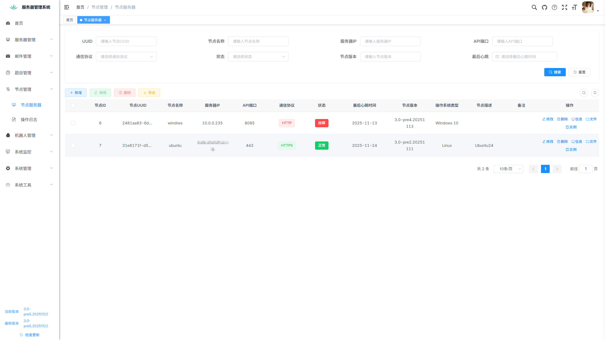
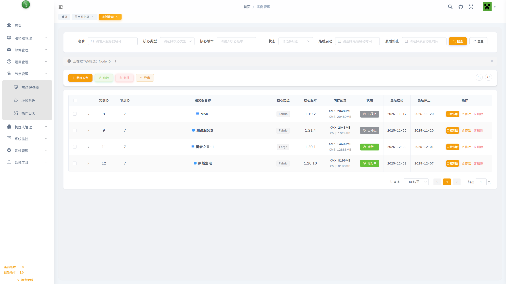
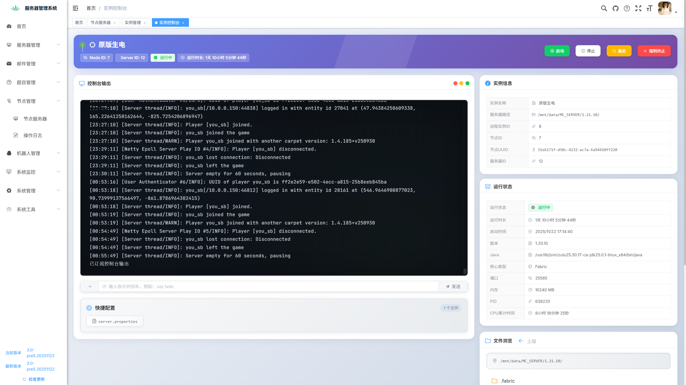
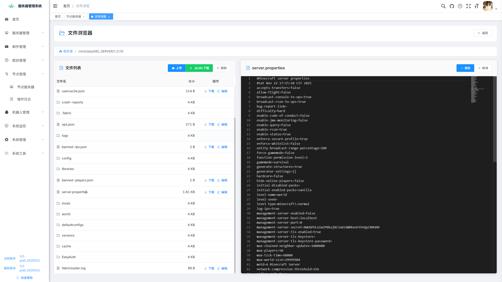

# 🎮 Minecraft 服务器智能运维管理系统

基于 **RuoYi-Vue** 框架开发，集成 Minecraft 多服务器管理、白名单智能审核、玩家行为追踪、RCON远程控制等强大功能，是面向 **服主、社群管理员、技术团队** 的全能服务器管理平台。

---

## ✨ 项目亮点

- 📊 多服务器统一仪表盘：实时状态、在线玩家、远程指令一站式管理
- ✅ 智能白名单系统：正版验证 + 答题审核 + 邮件通知 + IP防护
- 👥 玩家行为管理：游戏记录追踪 / 封禁系统 / 历史 ID / 多服同步
- 🤖 QQ群机器人联动：自助白名单申请、群内快捷命令、自动化审核
- 📈 数据可视化：玩家统计、答题通过率分析、定时任务日志等
- 🖥️ 分布式节点管理：主控-节点架构，支持跨服务器远程管理与文件操作

---

## 📚 使用教程

详细使用教程、更新日志与开发计划请见官方博客：

🔗 https://blog.endmc.cc/archives/endless.html

---

## 🧱 技术栈

### 后端技术

- Spring Boot
- MyBatis
- Redis
- MySQL
- JWT

### 前端技术

- Vue.js
- Element UI
- Axios
- Vue Router
- Vuex

---

## ⚙️ 快速开始

### 环境要求

- JDK 1.8
- Maven 3.2+
- MySQL 5.7+
- Redis 5.0+
- Node.js 16（白名单前端需 Node.js 18）

### 部署流程

1. 克隆项目：
    ```bash
    git clone [项目地址]
    ```

2. 初始化数据库：
    ```sql
    create database minecraft_manager character set utf8mb4 collate utf8mb4_general_ci;
    ```
    导入 `/sql` 文件夹中的 SQL 脚本。

3. 修改配置：

    - `application.yml` 和 `application-druid.yml` 中配置数据库与上传路径
    - 配置 Redis 地址与密码
    - `endless-ui/vue.config.js` 中配置代理 API 地址

4. 启动服务：

    后端：
    ```bash
   # 从 GitHub Releases 下载最新版本
   https://github.com/pilgrimage233/Minecraft-Rcon-Manage/releases
    ```
   启动服务：
5. ```
   java -jar endless-manager.jar
   ```

    前端：
    ```bash
    cd endless-ui
    npm install --registry=https://registry.npmmirror.com
    npm run dev
    ```

    白名单前端（独立部署）：
    - 项目地址：[whitelist-vue](https://github.com/pilgrimage233/whitelist-vue)
    - 推荐部署平台：Cloudflare Pages
    - 修改 `.env` 设置 `VITE_API_URL=http://your-domain/prod-api`

5. 访问系统：http://localhost:80

---

## 🔐 系统功能指南

### 登录

- 默认账号：`admin`
- 默认密码：`admin123`

### 模块总览

#### 🧩 服务器管理
- 添加/编辑 Minecraft 服务器
- 支持 RCON 配置

#### 🎫 白名单管理
- QQ群内自助答题式审核
- 后台实时查看审核申请与状态

#### 🧍 玩家管理
- 玩家列表、封禁与解封
- 查看游戏行为、游玩时长、地理来源

#### 🕒 定时命令
- 使用 cron 表达式设置自动执行命令

#### 🔐 OP 管理
- 权限记录 + 审计日志追踪

#### 🤖 QQ机器人管理
- 群内命令（如重启、查询在线数）
- 白名单申请全自动无人值守处理
- 智能验证码 + 行为防爬虫策略

#### 🖥️ 节点管理（新增）

- **节点服务器**：注册、监控、管理多个节点服务器
- **实例管理**：远程创建、启动、停止 Minecraft 服务器实例
- **文件管理**：跨服务器文件浏览、上传、下载
- **控制台**：实时查看服务器输出，发送游戏命令
- **操作日志**：完整的节点操作审计追踪

---

## 🖼 系统截图

### 前台（白名单页面）

| 白名单申请 | 玩家详情 | 成员列表 |
|------------|----------|----------|
|  |  |  |

### 后台管理界面

| 系统首页 | 白名单管理 | 玩家管理 | IP限流 |
|---------|------------|----------|--------|
|  |  |  |  |

### 节点管理界面

| 节点服务器列表               | 实例管理                  | 服务器控制台                | 文件管理                   |
|-----------------------|-----------------------|-----------------------|------------------------|
|  |  |  |  |

---

## 📌 常见问题排查

### ❌ 数据库连接失败
- 检查配置文件、数据库权限、服务是否启动

### ❌ Redis无法连接
- 确认 Redis 配置项、密码正确，服务运行中

### ❌ RCON连接失败
- Minecraft `server.properties` 中启用 RCON：
    ```properties
    enable-rcon=true
    rcon.password=your_password
    rcon.port=25575
    ```

### ❌ 前端打不开
- 检查前端是否启动、API地址配置是否正确

---

## 📁 项目结构

```
├── endless-admin        // 后端主模块
├── endless-common       // 通用工具
├── endless-framework    // 核心框架封装
├── endless-generator    // 代码生成模块
├── endless-quartz       // 定时任务模块
├── endless-system       // 系统功能模块
├── endless-ui           // 后台前端项目
├── endless-server       // Minecraft服务器扩展模块
└── endless-node         // 节点管理模块（主控端）
```

### 节点管理架构

本系统采用 **主控-节点** 分布式架构，支持跨服务器远程管理：

- **主控端（Master）**：`endless-node` 模块，负责节点注册、认证、指令下发
- **节点端（Node）**：独立项目 [Endless-Node](https://github.com/pilgrimage233/Endless-Node)，部署在目标服务器上，接收主控端指令并执行

---

## 🧩 特别说明

### 邮件通知
- 可配置邮件推送（如阿里云邮件服务）
- 项目原生支持：aliyun, qq, 163, gmail, outlook 如不在上述服务商可自定义SMTP服务器

### 节点管理系统

#### 架构说明

本系统采用主控-节点（Master-Node）分布式架构，实现跨服务器的统一管理：

**主控端（endless-node 模块）**

- 节点注册与认证管理
- 服务器实例远程控制
- 文件操作与传输
- 实时状态监控
- 操作日志记录

**节点端（Endless-Node 项目）**

- 独立部署在目标服务器
- 接收主控端指令并执行
- 提供文件操作 API
- 管理本地服务器实例
- 实时上报运行状态

#### 核心功能

##### 1. 节点服务器管理

- **节点注册**：通过 IP + 端口 + Token 绑定节点
- **状态监控**：实时心跳检测，自动更新节点状态
- **负载查看**：CPU、内存、磁盘使用率实时监控
- **版本管理**：节点版本信息与操作系统类型识别

##### 2. 远程文件操作

- **文件浏览**：支持任意路径的文件列表查看
- **文件上传**：从主控端上传文件到节点服务器
- **文件下载**：从节点服务器下载文件到本地
- **URL下载**：节点服务器直接从URL下载文件
- **文件删除**：远程删除节点服务器上的文件

##### 3. 服务器实例管理

- **实例创建**：在节点上创建新的 Minecraft 服务器实例
- **启动/停止**：远程控制服务器启动与停止
- **重启/强制终止**：支持优雅重启和强制终止
- **自定义脚本**：支持自定义启动和停止脚本
- **控制台访问**：实时查看服务器控制台输出（WebSocket）
- **命令执行**：向服务器发送游戏内命令
- **状态同步**：定时任务自动同步服务器运行状态

##### 4. 安全与认证

- **Token 认证**：所有 API 请求需携带有效 Token
- **权限控制**：基于角色的访问控制（RBAC）
- **操作审计**：完整的操作日志记录与追踪
- **IP 白名单**：可配置允许访问的 IP 地址

#### 部署指南

##### 主控端部署

主控端已集成在本项目的 `endless-node` 模块中，随主项目一起部署。

配置文件位置：`endless-admin/src/main/resources/application.yml`

##### 节点端部署

1. **下载节点端程序**
   ```bash
   # 从 GitHub Releases 下载最新版本
   https://github.com/pilgrimage233/Endless-Node/releases/
   ```

2. **配置节点端**

   创建 `application.yml` 配置文件：
   ```yaml
   server:
     port: 8080  # 节点API端口
   ```

3. **启动节点端**
   ```bash
   java -jar Endless-Node.jar
   ```

4. **获取访问令牌**

   首次启动后，访问 `http://节点IP:端口/tokens.html` 查看自动生成的访问令牌。

5. **在主控端注册节点**

   登录主控端管理后台，进入 **节点管理 > 节点服务器**，添加新节点：
    - 节点名称：自定义名称
    - 服务器IP：节点服务器的IP地址
    - API端口：节点端配置的端口（默认8080）
    - 通信协议：http 或 https
    - 秘钥：从节点端获取的访问令牌

#### 使用示例

##### 创建并启动服务器实例

1. 在主控端进入 **节点管理 > 实例管理**
2. 点击 **新增实例**，填写信息：
    - 选择节点服务器
    - 服务器名称：如 "生存主世界"
    - 服务端路径：如 `/data/minecraft/survival`
    - 核心类型：Paper / Spigot / Bukkit 等
    - 版本号：如 1.20.1
    - JVM参数：配置内存和其他参数
3. 保存后，点击 **启动** 按钮
4. 点击 **控制台** 查看实时输出

##### 远程文件管理

1. 进入 **节点管理 > 文件管理**
2. 选择目标节点服务器
3. 浏览文件目录，支持：
    - 上传本地文件
    - 下载服务器文件
    - 从URL下载文件到服务器
    - 删除文件或目录

#### API 文档

节点端提供完整的 RESTful API，详见：

- [Endless-Node API 文档](https://github.com/pilgrimage233/Endless-Node#api-%E6%96%87%E6%A1%A3)

#### 技术栈

**主控端（endless-node）**

- Spring Boot
- MyBatis-Plus
- WebSocket（实时控制台）
- Quartz（定时任务）

**节点端（Endless-Node）**

- Spring Boot 3.4.4
- MyBatis-Plus 3.5.10
- SQLite（本地数据库）
- WebSocket（控制台推送）
- OSHI（系统信息采集）

### 若依文档资源
- [若依官方文档](http://doc.ruoyi.vip/)
- [RuoYi-Vue 开发手册](http://doc.ruoyi.vip/ruoyi-vue/)

---

## 🤝 贡献指南

欢迎社区开发者提交 Issue 和 Pull Request。

---

## 📜 开源协议

本项目使用 **GPL-3.0** 开源许可协议。

---

## 📬 联系方式

- 📧 Email：admin@endmc.cc
- 🧑‍💻 QQ群：702055554

---

## � 相关项目

- **Endless-Node**：节点端程序，部署在目标服务器上
    - GitHub：https://github.com/pilgrimage233/Endless-Node
    - 功能：接收主控端指令，管理本地服务器实例
    - 技术栈：Spring Boot 3.4.4 + SQLite + WebSocket

- **whitelist-vue**：白名单前端独立部署项目
    - GitHub：https://github.com/pilgrimage233/whitelist-vue
    - 推荐部署：Cloudflare Pages

## 🙏 致谢

- [RuoYi-Vue](https://gitee.com/y_project/RuoYi-Vue)
- [Element UI](https://element.eleme.cn)
- [OSHI](https://github.com/oshi/oshi) - 系统信息采集库
- 以及所有支持与反馈的开源社区成员！

---

💡 **打造更专业的 Minecraft 运维体验，从这里开始！**

