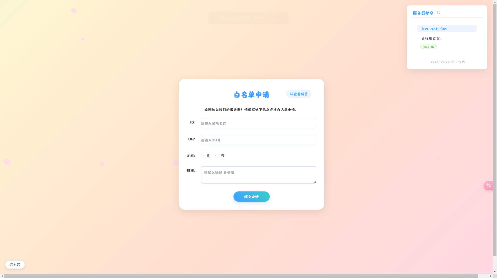
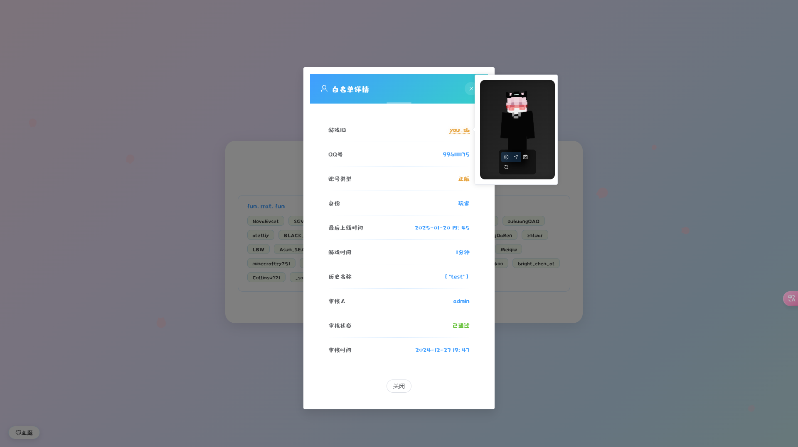
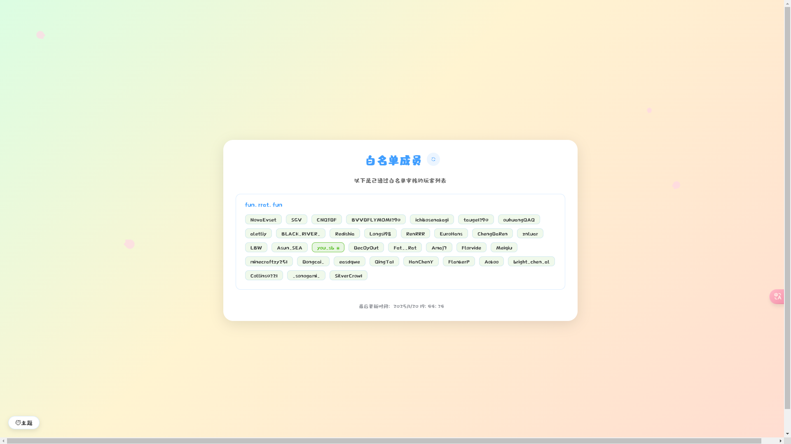
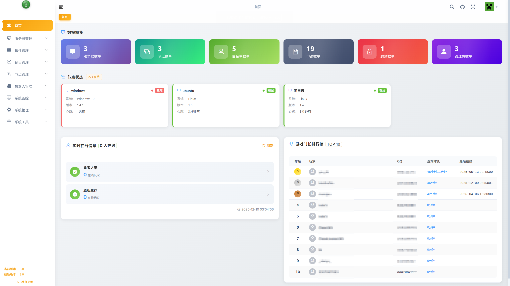
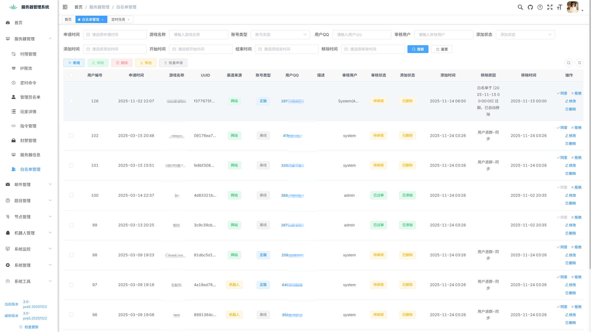
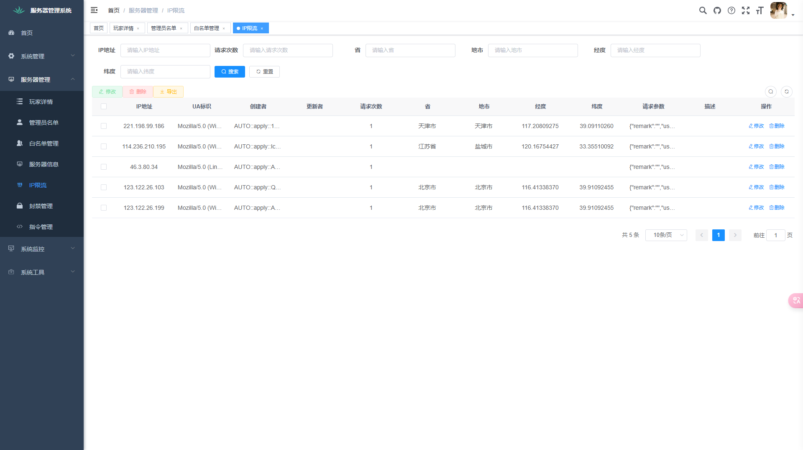

# 🎮 Minecraft 服务器智能运维管理系统

基于 **RuoYi-Vue** 框架开发，集成 Minecraft 多服务器管理、白名单智能审核、玩家行为追踪、RCON远程控制等强大功能，是面向 **服主、社群管理员、技术团队** 的全能服务器管理平台。

---

## ✨ 项目亮点

- 📊 多服务器统一仪表盘：实时状态、在线玩家、远程指令一站式管理
- ✅ 智能白名单系统：正版验证 + 答题审核 + 邮件通知 + IP防护
- 👥 玩家行为管理：游戏记录追踪 / 封禁系统 / 历史 ID / 多服同步
- 🤖 QQ群机器人联动：自助白名单申请、群内快捷命令、自动化审核
- 📈 数据可视化：玩家统计、答题通过率分析、定时任务日志等

---

## 📚 使用教程

详细使用教程、更新日志与开发计划请见官方博客：

🔗 https://blog.endmc.cc/archives/endless.html

---

## 🧱 技术栈

### 后端技术

- Spring Boot
- MyBatis
- Redis
- MySQL
- JWT

### 前端技术

- Vue.js
- Element UI
- Axios
- Vue Router
- Vuex

---

## ⚙️ 快速开始

### 环境要求

- JDK 1.8
- Maven 3.2+
- MySQL 5.7+
- Redis 5.0+
- Node.js 16（白名单前端需 Node.js 18）

### 部署流程

1. 克隆项目：
    ```bash
    git clone [项目地址]
    ```

2. 初始化数据库：
    ```sql
    create database minecraft_manager character set utf8mb4 collate utf8mb4_general_ci;
    ```
    导入 `/sql` 文件夹中的 SQL 脚本。

3. 修改配置：

    - `application.yml` 和 `application-druid.yml` 中配置数据库与上传路径
    - 配置 Redis 地址与密码
    - `endless-ui/vue.config.js` 中配置代理 API 地址

4. 启动服务：

    后端：
    ```bash
    ./ry.sh  # Linux
    ry.bat   # Windows
    ```

    前端：
    ```bash
    cd endless-ui
    npm install --registry=https://registry.npmmirror.com
    npm run dev
    ```

    白名单前端（独立部署）：
    - 项目地址：[whitelist-vue](https://github.com/pilgrimage233/whitelist-vue)
    - 推荐部署平台：Cloudflare Pages
    - 修改 `.env` 设置 `VITE_API_URL=http://your-domain/prod-api`

5. 访问系统：http://localhost:80

---

## 🔐 系统功能指南

### 登录

- 默认账号：`admin`
- 默认密码：`admin123`

### 模块总览

#### 🧩 服务器管理
- 添加/编辑 Minecraft 服务器
- 支持 RCON 配置

#### 🎫 白名单管理
- QQ群内自助答题式审核
- 后台实时查看审核申请与状态

#### 🧍 玩家管理
- 玩家列表、封禁与解封
- 查看游戏行为、游玩时长、地理来源

#### 🕒 定时命令
- 使用 cron 表达式设置自动执行命令

#### 🔐 OP 管理
- 权限记录 + 审计日志追踪

#### 🤖 QQ机器人管理
- 群内命令（如重启、查询在线数）
- 白名单申请全自动无人值守处理
- 智能验证码 + 行为防爬虫策略

---

## 🖼 系统截图

### 前台（白名单页面）

| 白名单申请 | 玩家详情 | 成员列表 |
|------------|----------|----------|
|  |  |  |

### 后台管理界面

| 系统首页 | 白名单管理 | 玩家管理 | IP限流 |
|---------|------------|----------|--------|
|  |  |  |  |

---

## 📌 常见问题排查

### ❌ 数据库连接失败
- 检查配置文件、数据库权限、服务是否启动

### ❌ Redis无法连接
- 确认 Redis 配置项、密码正确，服务运行中

### ❌ RCON连接失败
- Minecraft `server.properties` 中启用 RCON：
    ```properties
    enable-rcon=true
    rcon.password=your_password
    rcon.port=25575
    ```

### ❌ 前端打不开
- 检查前端是否启动、API地址配置是否正确

---

## 📁 项目结构

```
├── endless-admin        // 后端主模块
├── endless-common       // 通用工具
├── endless-framework    // 核心框架封装
├── endless-generator    // 代码生成模块
├── endless-quartz       // 定时任务模块
├── endless-system       // 系统功能模块
├── endless-ui           // 前端项目（ruoyi-ui）
└── endless-server       // Minecraft服务器扩展模块
```

---

## 🧩 特别说明

### 邮件通知
- 可配置邮件推送（如阿里云邮件服务）
- 项目原生支持：aliyun, qq, 163, gmail, outlook 如不在上述服务商可自定义SMTP服务器

### 若依文档资源
- [若依官方文档](http://doc.ruoyi.vip/)
- [RuoYi-Vue 开发手册](http://doc.ruoyi.vip/ruoyi-vue/)

---

## 🤝 贡献指南

欢迎社区开发者提交 Issue 和 Pull Request。

---

## 📜 开源协议

本项目使用 **GPL-3.0** 开源许可协议。

---

## 📬 联系方式

- 📧 Email：admin@mcpeach.cc
- 🧑‍💻 QQ群：702055554

---

## 🙏 致谢

- [RuoYi-Vue](https://gitee.com/y_project/RuoYi-Vue)
- [Element UI](https://element.eleme.cn)
- 以及所有支持与反馈的开源社区成员！

---

💡 **打造更专业的 Minecraft 运维体验，从这里开始！**

